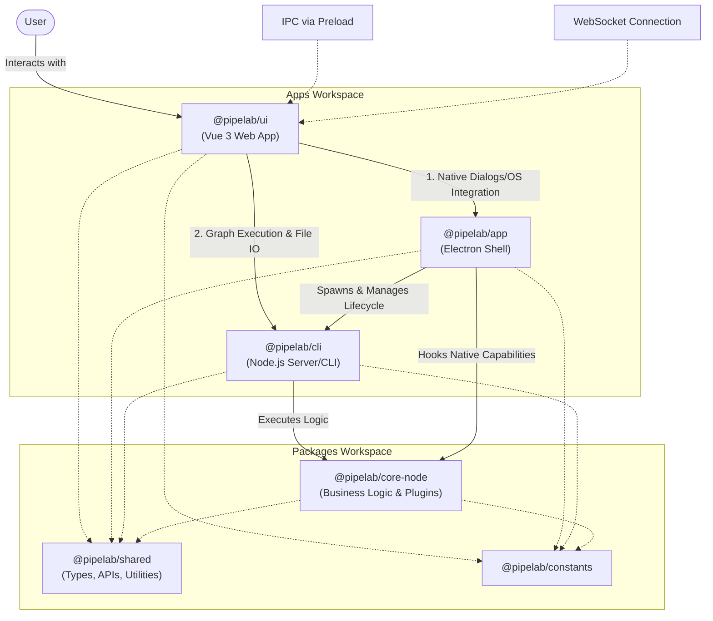

# Pipelab Architecture

Pipelab has a modular architecture designed to support both a rich desktop experience and standalone execution in headless environments (like CI/CD pipelines).

## High-Level Diagram

The following diagram illustrates how the different packages in the monorepo interact, especially in the context of the Desktop Application.

## Core Components

### 1. `@pipelab/ui` (The Frontend)

A standalone Vite + Vue 3 Single Page Application (SPA).

- **Responsibility**: Rendering the visual node editor, settings, and pipeline management interfaces.
- **Agnostic**: It does not import any Node.js or Electron-specific code.
- **Routing**: It uses an intelligent API composable (`useAPI`) that routes requests:
  - **Native OS Tasks** (e.g., Opening a file picker dialog) are sent to the Electron shell via IPC.
  - **Core Tasks** (e.g., Executing a pipeline, reading/writing project files) are sent to the standalone CLI server via WebSockets.

### 2. `@pipelab/app` (The Desktop Shell)

A thin Electron wrapper around the UI and the CLI.

- **Responsibility**: Providing OS-level integration (File Dialogs, Auto-updates, System Tray) and managing the lifecycle of the underlying CLI server.
- **Startup Flow**:
  1. Electron starts up extremely fast as it loads minimal dependencies.
  2. It spawns the `@pipelab/cli` server as a background child process.
  3. It loads the `@pipelab/ui` web application in a `BrowserWindow`.
- **Context Injection**: It injects native Electron capabilities (like `BrowserWindow` focus and `dialog` modules) into the shared `SystemContext` so the core logic can request UI prompts if necessary.

### 3. `@pipelab/cli` (The Standalone Server & CLI)

A Node.js command-line interface, bundled into standalone binaries using `pkg` for production.

- **Responsibility**: Running the WebSocket server that the UI connects to, and eventually serving as a headless runner for CI/CD environments.
- **Capabilities**: It has full file-system access and runs the heavy Node.js plugins (Docker, zip extraction, external command execution).

### 4. `@pipelab/core-node` (The Brains)

A shared library containing all the Node.js specific business logic.

- **Responsibility**: Defining the WebSocket server, IPC handlers, plugin execution engine, and file system operations.
- **Environment Agnostic**: It relies on an injected `SystemContext` to abstract away whether it is running inside an Electron main process or a headless CLI.

### 5. `@pipelab/shared` & `@pipelab/constants`

Shared libraries containing code that is safe to run in both Node.js and Browser environments.

- **Responsibility**: Defining data models, IPC definitions, validation schemas, and common utilities used across the entire monorepo.
