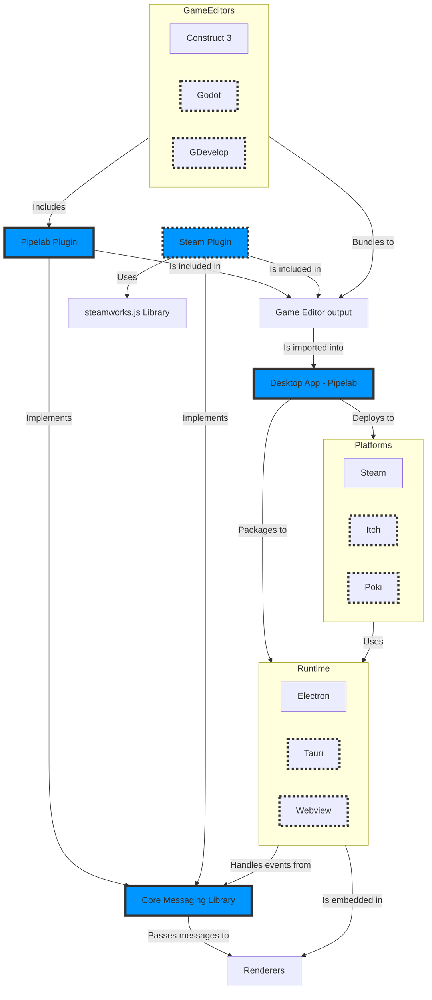

# Pipelab


## What is Pipelab?

A visual tool to create task automation workflows.

## Why use Pipelab?

- Create cross-platform desktop applications
- Deploy to popular platforms (Steam, Itch.io, etc.)
- Automate repetitive tasks

# Getting Started

# Making a release
```
yarn changeset version
yarn changeset tag
```

# Architecture


# Development
## Enable source maps
```bash
NODE_OPTIONS=--enable-source-maps yarn xxx
```
