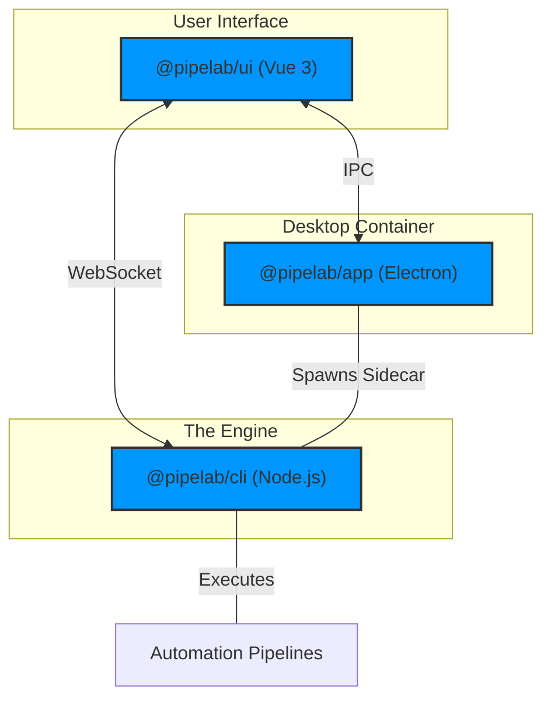

# Pipelab


Pipelab is a visual automation tool designed to create task automation workflows and cross-platform desktop applications.

## 🏗️ Orchestration Overview

Pipelab is built as a monorepo with three primary application layers that work together to provide a seamless automation experience:


```mermaid
graph TD
    classDef main fill:#0096FF,stroke:#333,stroke-width:2px;

    subgraph UserInterface["User Interface"]
        UI["@pipelab/ui (Vue 3)"]
    end

    subgraph Container["Desktop Container"]
        Electron["@pipelab/app (Electron)"]
    end

    subgraph Engine["The Engine"]
        CLI["@pipelab/cli (Node.js)"]
    end

    UI <-->|WebSocket| CLI
    UI <-->|IPC| Electron
    Electron ---|Spawns Sidecar| CLI
    CLI ---|Executes| Pipelines[Automation Pipelines]

    class UI,Electron,CLI main;
```

- **The Engine (@pipelab/cli)**: A standalone Node.js server that handles the heavy lifting. It executes pipelines, manages plugin logic, and exposes a WebSocket API.
- **The Interface (@pipelab/ui)**: A Vue 3 application that provides the visual graph editor. It connects to the CLI via WebSockets for real-time execution feedback.
- **The Container (@pipelab/app)**: An Electron wrapper that provides native OS integration (file dialogs, system tray). In production, it automatically manages the CLI as a "sidecar" process.

---

## 🛠️ Setup & Development

### 1. Prerequisites

Tool versions are managed via **mise**. Check [`.mise.toml`](.mise.toml) for the current requirements.

### 2. Environment Configuration

Create a `.env` file in the **root directory**. This is the single source of truth for all packages:

```env
SUPABASE_URL=your_project_url
SUPABASE_ANON_KEY=your_key
POSTHOG_API_KEY=your_key
```

### 3. Installation

```bash
pnpm install
```

### 4. Running Development Mode

The fastest way to start the entire ecosystem is from the root:

```bash
pnpm dev
```

> [!TIP]
> This command uses **Turborepo** to start the UI dev server, the Electron process, and the CLI server concurrently.

---

## 📦 Project Structure

- **`apps/cli`**: The headless engine and WebSocket server.
- **`apps/desktop`**: The Electron lifecycle and IPC handlers.
- **`apps/ui`**: Rendering and visual graph interaction.
- **`packages/*`**: Shared logic, standard constants, and modular plugins (Steam, Discord, etc.).

---

## 🚀 Releases & Versioning

We use **Changesets** to manage versions and changelogs:

```bash
pnpm changeset          # Document a change
pnpm changeset version  # Bump versions
pnpm changeset tag      # Create git tags
```
