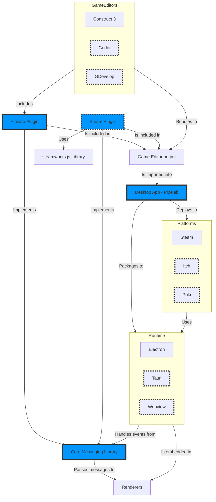

# Pipelab


## What is Pipelab?

A visual tool to create task automation workflows.

## Why use Pipelab?

- Create cross-platform desktop applications
- Deploy to popular platforms (Steam, Itch.io, etc.)
- Automate repetitive tasks

# Getting Started

## Patch a packaged Windows executable

Enable **Patch executable** in Electron's **Package app with configuration** action
to patch its Windows executable with [gpupatch](https://github.com/CynToolkit/gpupatch).
For workflows using **Configure Electron** followed by **Package app**, enable the
same option in **Configure Electron**. The option defaults to off.

Patching requests high-performance NVIDIA or AMD discrete GPU usage on Windows
laptops. It runs after packaging and before the output folder is published. It
applies only to Package app actions; **Create Installer** and **Preview app** do not
apply it. Non-Windows targets skip patching with a log message.

Pipelab downloads gpupatch v0.2.1 on first use and caches the matching host binary.
Supported hosts are Windows x64, Linux x64, and macOS x64 or arm64. A supported host
can patch a Windows target; .NET is not required. Download or patch failures fail
the packaging action, and failed or cancelled patches preserve the original file.

The standalone **NVPatch / Patch binary** action is deprecated. To migrate, enable
**Patch executable** in the Electron packaging configuration, then remove the
separate NVPatch step. Existing NVPatch workflows remain available with their
existing .NET requirements.

# Making a release

```
pnpm changeset version
pnpm changeset tag
```

# Architecture


```mermaid
graph TD
    classDef pipelab fill:#0096FF,stroke:#333,stroke-width:4px;
    classDef todo stroke:#333,stroke-width:4px, stroke-dasharray: 4px;

    DesktopApp[Desktop App - Pipelab]
    GameBundle[Game Editor output]

    subgraph GameEditors
        Construct3[Construct 3]
        Godot[Godot]
        GDevelop[GDevelop]
    end

    PipelabPlugin[Pipelab Plugin]
    SteamPlugin[Steam Plugin]
    CoreMessaging[Core Messaging Library]
    Renderers[Renderers]

    subgraph Runtime
        Electron
        Tauri
        Webview
    end

    subgraph Platforms
        Steam
        Itch
        Poki
    end

    Steamworks[steamworks.js Library]

    GameEditors -->|Bundles to| GameBundle
    GameBundle -->|Is imported into| DesktopApp
    GameEditors -->|Includes| PipelabPlugin

    PipelabPlugin -->|Is included in| GameBundle
    PipelabPlugin -->|Implements| CoreMessaging

    SteamPlugin -->|Is included in| GameBundle
    SteamPlugin -->|Implements| CoreMessaging
    SteamPlugin -->|Uses| Steamworks

    CoreMessaging -->|Passes messages to| Renderers
    Runtime -->|Is embedded in| Renderers
    DesktopApp -->|Packages to| Runtime
    Runtime -->|Handles events from| CoreMessaging

    DesktopApp -->|Deploys to| Platforms
    Platforms -->|Uses| Runtime

    class DesktopApp,PipelabPlugin,SteamPlugin,CoreMessaging pipelab;
    class SteamPlugin,Godot,GDevelop,Tauri,Webview,Itch,Poki todo;
```

# Development

## Enable source maps

```bash
NODE_OPTIONS=--enable-source-maps pnpm xxx
```
