# How Pipelab runs your work

The desktop app is made from an Electron shell, a Vue UI, and a local Node.js
engine. The shell starts or resolves the CLI server, and the UI connects to the
engine. In production, the server also serves the bundled UI.

## Request paths

1. The Vue editor sends engine requests over the local WebSocket connection.
2. The Electron preload bridge exposes native operations such as file dialogs
   to the UI through IPC.
3. The Node engine owns plugin execution, file operations, and run history.

The standalone CLI can start the server with `pipelab serve`; its default
address is `127.0.0.1:33753`. Binding beyond loopback in production requires an
authentication token. See the [CLI reference](/cli/reference#server).

## Two execution models

The **pipeline** graph executor loads plugin actions and processes its saved
action blocks in order. Successful action outputs are recorded by block ID.
The **Release workflow** planner validates sources, producers, destinations,
artifact compatibility, and dependencies before compiling task steps for the
workflow runtime. Ready workflow steps can run concurrently when their
dependencies allow it.

The desktop UI is the primary editor for both. The CLI can run a legacy
pipeline JSON file with `pipelab run`, or a saved Release workflow with
`pipelab workflow run`. These commands use different saved inputs and
execution behavior.

For implementation ownership, package boundaries, and contribution setup, see
[Contributor architecture](/contributing/architecture).
