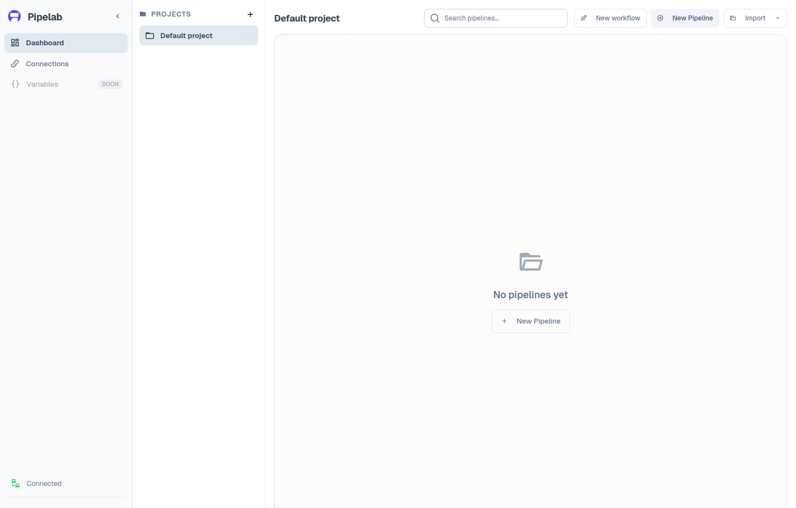

# Create your first project and pipeline

This guide follows the desktop app's project and pipeline path. It does not
create a Release workflow; that is a separate flow in
[Build and ship with a Release workflow](/guide/release-workflows).

## Create a project

1. Start Pipelab and wait for the dashboard to load.
2. Create a project and give it a name.
3. Select the project before creating a pipeline.

A project groups pipelines and Release workflows. Creating a pipeline is a
separate action inside the selected project. New pipelines use Pipelab's
internal storage by default. Import can bring in a pipeline file or
configuration; project deletion is unavailable while it still contains
pipelines or is referenced by a Release workflow.

## Create and configure a pipeline

1. Choose **New pipeline** and select one of the available presets.
2. Open the pipeline editor and add a task from the plugin task picker.
3. Choose from the plugins already available in this build. The bundled
   desktop app does not install or activate plugins from the task picker.
4. Fill the required parameters shown by the task editor. Some fields also
   offer an advanced editor.
5. Save the pipeline.

The task picker is populated from plugin definitions. A task can have required
inputs and host-platform constraints, so use the provider or task guide for
its exact requirements. The [provider catalog](/guide/integrations/) links to
the registered tasks.

## Run and inspect

1. Sign in to your Pipelab account.
2. Choose **Run**. Pipelab validates required inputs and available plugins
   before execution.
3. Follow the active task, logs, and generated artifact paths in the editor.
4. Cancel a running pipeline from the editor if needed. Pipeline history is
   recorded locally by default. The legacy **Build History** dialog requires
   an account with the Build History benefit; it is separate from Release
   workflow run history.

The graph executor processes action blocks in their saved order. If an action
fails, execution stops at that error. Pipelab stores build history unless
history has been disabled in the host environment. For the separate Release
workflow Runs screen, see [runs and history](/guide/runs-and-history).

## Continue with a Release workflow

Use a Release workflow when you need to select a source, build targets, and
delivery destinations. Its **Ship** action and run history are separate from
the graph pipeline editor. Start with the
[Release workflow guide](/guide/release-workflows).

If the dashboard remains disconnected or required data fails to load, use the
retry action and follow [troubleshooting](/guide/troubleshooting).
