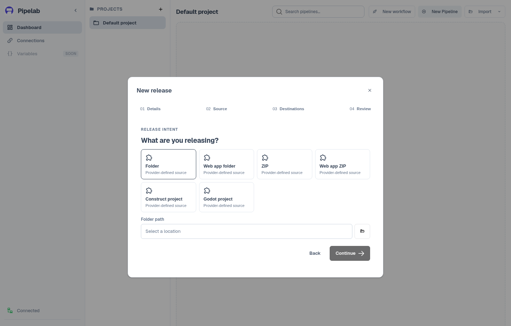

# Build and ship with a Release workflow

A Release workflow prepares an artifact and routes it to one or more
destinations. It uses a different editor and runtime from the graph-based
[pipeline](/guide/pipelines).

## Configure a workflow

1. From the dashboard, choose **New workflow** in a project.
2. Complete **Details**, select and configure a **Source**, then add
   **Destinations** and their deployment slots. Pipelab checks the selected
   Source as you fill its fields. Blocking issues appear beside the relevant
   field; retry the inspection if it fails.
3. On **Review**, check the proposed setup. Pipelab resolves a recommended
   build when a destination needs one and validates the result with the
   workflow planner. For a typical desktop project, this can add an Electron
   build for Windows x64 automatically.
4. Choose **Create release**. If a destination needs build setup that cannot
   be resolved automatically, the workflow is still created as a draft and its
   readiness state explains what needs attention.



Provider cards are populated from the providers available in the application.
Compatibility depends on the artifact type, destination, selected target, and
host. The [provider catalog](/guide/integrations/) links to the exact inputs,
credentials, tools, and target limitations for each provider.

## Workflow sections

The workflow editor has four sections: **Configuration**, **Builds**,
**Artifacts**, and **Runs**. Configuration is the main view for the source and
destinations. Its settings save automatically as you edit; there is no Save
button. Opening a workflow does not change its saved build or routing choices.
Choose **Add destination** to open the provider picker. Provider-specific
settings remain in each destination's edit view.

Use **Builds** when you want to customize producers or targets. Adding a build
is an explicit choice: select its type, engine, and target. Changing an engine
clears incompatible targets until you select a replacement. The catalog shows
when a target is unavailable on the current host and why. Configure a build to
edit its settings or remove it; references to its outputs are never rerouted
automatically.

Use **Artifacts** to find outputs across runs of this workflow. Artifact
metadata is shown only when the run provides it. Local artifacts can be opened
and cloud artifacts downloaded when those actions are available. Each artifact
links back to its originating run. The **Runs** section remains available for
run status, logs, and delivery details.

## Sources, builds, and destinations

- A **source** provides the project or files that enter the workflow.
- A **build** chooses a producer and one or more build targets. Pipelab can
  recommend and validate a build during workflow creation. Later changes are
  made explicitly in the Builds section. A producer may inspect the project
  and report missing prerequisites before running.
- A **destination** receives a source or build artifact. Each **deployment
  slot** chooses the artifact it will receive and stores provider-specific
  settings.

The planner checks provider compatibility and can insert a provider-declared
transform, such as extracting an archive when a producer requires a folder. A
workflow can use one build output in more than one destination. Provider
requirements are documented on their own pages, for example
[Steam](/guide/publishing/steam), [itch.io](/guide/publishing/itch), and
[Poki](/guide/publishing/poki).

## Inspect a workflow without running it

The CLI can plan and compile a saved Release workflow without running its
tasks:

```sh
pipelab workflow run release-id --dry-run --output ./release-plan.json
```

Replace `release-id` with a saved workflow ID or a unique workflow name. A
dry-run validates providers and references, then writes the plan if `--output`
is provided. It does not execute deployment tasks. See the
[workflow reference guide](/guide/workflow-references) and
[CLI reference](/cli/reference#run-a-saved-release-workflow).

## Follow the run

Choose **Ship** to save the current workflow, validate the saved configuration,
and start execution. Pipelab only starts the run after the current edits have
saved and the planner reports a valid plan. After shipping, use **Runs** to
inspect status, step logs, and delivery results, or **Artifacts** to discover
outputs across runs. The [Runs and history guide](/guide/runs-and-history)
covers the run list, artifacts, and detail view.

Release workflows are not scheduled by Pipelab's current workflow format. The
workflow runs when you choose **Ship** in the editor or invoke it through the
CLI.
